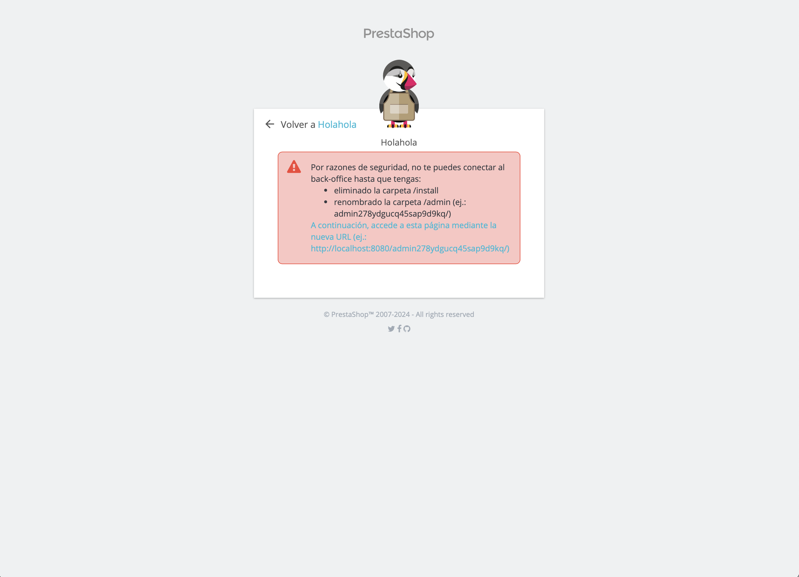

# TAREA 6
*Esteban Miguel Montes Adraz* - *2DAM* - *SXE*

---
## UTilizar docker para poner en marcha Prestashop

* Primero vamos a crear una carpeta llamada prestashop para poder organizarlo todo mejor
```
mkdir prestashop 
cd prestashop
```
* Luego vamos a crear el archivo docker-compose y accederemos a él con nano
```
touch docker-compose.yml
nano docker-compose.yml
```
* Una vez dentro, añadiremos lo siguiente
```yml
services:
  mysql:
    container_name: some-mysql
    image: mysql:5.7
    restart: unless-stopped
    environment:
      MYSQL_ROOT_PASSWORD: admin
      MYSQL_DATABASE: prestashop
    networks:
      - prestashop_network
  prestashop:
    container_name: prestashop
    image: prestashop/prestashop:latest 
    restart: unless-stopped
    depends_on:
      - mysql
    ports:
      - 8080:80
    environment:
      DB_SERVER: some-mysql
      DB_NAME: prestashop
      DB_USER: root
      DB_PASSWD: admin
    networks:
      - prestashop_network
networks:
    prestashop_network:
```
* Nos quedaría así


* Ahora vamos a ejecutar el contenedor con el siguiente comando y luego comprobaremos que está todo correctamente descargado
```
docker-compose up -d

docker ps -a
```
* Debería salir algo así 


* Por último accederemos a la dirección ```http://localhost:8080/``` y comprobamos que se ha instalado todo correctamente 


* Rellenamos los datos de nuestra tienda


* Conectamos la base de datos


* Y aquí tenemos nuestra tienda hecha


* Al intentarnos conectar al back-office nos saltará este error

Para arreglarlo, haremos lo que nos dice en el recuadro
    1. Primero ejecutaremos el contenedor prestashop de esta manera
    ```
    docker exec -it prestashop /bin/bash
    ```
    2. Eliminamos el archivo y el directorio```install/*```
    ```
    rm -r install/*
    rmdir install/
    ```
    3. Cambiamos de nombre al archivo ```admin``` 
    ```
    mv admin/ admin1
    ```
* Finalmente podremos acceder al back-office

